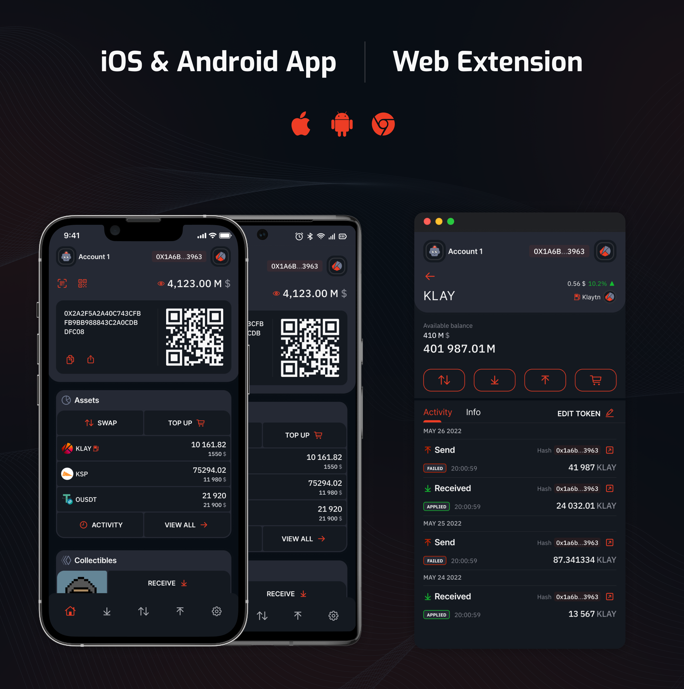

# 📝  About

Oko Wallet - is a non-custodial EVM multichain wallet available **browser extension**, **iOS** and **Android** applications.

The wallet supports all EVM chains, but **Klaytn, BNB Chain, Polygon, Ethereum, Arbitrum, Avalanche, Optimism,** and **Fantom** were added as default chains.

The future releases will include a unique widget system. Information about this will be added soon.

🌎 [https://www.okowallet.app/](https://www.okowallet.app/)



# ▶️  Installation

There are extension and mobile application versions of Oko Wallet, and here you can find instructions to build them:

## Environment setting up

- Install [Node.js](https://nodejs.org)

- If you want to run iOS/Android applications, [set up the React Native development environment](https://reactnative.dev/docs/environment-setup)

- Install dependencies with:
```bash
yarn install:all
```

- If you want to run iOS, install pods for the iOS application additionally:
```bash
run yarn install:pods
```

## Extension build

- Build the project to the `./apps/extension/dist/` folder with
```bash
yarn build extension
```

- Optionally, you may run yarn extension to run development mode:
```bash
yarn extension
```

- To load the extension:
	- go to `chrome://extensions/` in the browser;
	- enable `Developer mode` in the top right corner;
	- press `Load unpacked`;
	- select `dist` folder;

## Mobile build

- Run iOS build locally with:
```bash
yarn ios
```

- Run Android build locally with:
```bash
yarn android
```
